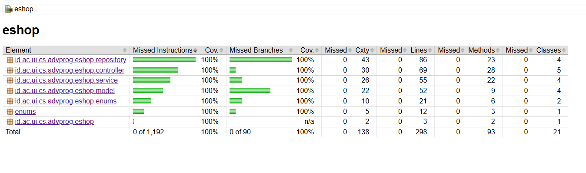

# Reflection Notes - Advanced Programming

Repositori ini memuat catatan refleksi pembelajaran dari pengerjaan modul-modul pada mata kuliah Pemrograman Lanjut.

---

## Deployment Link
Aplikasi E-Shop telah berhasil di-*deploy* dan dapat diakses melalui tautan berikut:  
**[https://squealing-matilda-alya-nabilla-advprog-2b91929b.koyeb.app/](https://squealing-matilda-alya-nabilla-advprog-2b91929b.koyeb.app/)**

---

## Module 1: Coding Standards

### Reflection 1

#### Clean Code and Secure Coding Principles
Dalam pengerjaan fitur-fitur pada modul ini, saya telah menerapkan beberapa prinsip *Clean Code* dan *Secure Coding* untuk menjaga kualitas perangkat lunak.

* **Single Responsibility Principle (SRP):** Diterapkan melalui arsitektur MVC, di mana saya memisahkan tanggung jawab antara `ProductController` (untuk *routing* dan *view*), `ProductService` (untuk logika bisnis), dan `ProductRepository` (untuk manipulasi data). Pemisahan ini membuat kode menjadi lebih modular dan mudah dipahami.
* **Meaningful Names:** Berfokus pada penamaan variabel dan metode yang deskriptif, seperti penggunaan `deleteProductById` yang lebih jelas tujuannya dibandingkan sekadar `delete`.
* **Secure Coding:** Mengganti penggunaan ID sekuensial (integer) menjadi **UUID (Universally Unique Identifier)**. Langkah ini krusial untuk mencegah serangan enumerasi (*Enumeration Attack*), di mana penyerang bisa menebak ID produk lain dengan mudah jika hanya menggunakan angka urut.

#### Source Code Analysis and Improvement
Selama proses pengembangan, saya menemukan beberapa kekurangan pada kode sumber asli dan menerapkan prinsip **Boy Scout Rule** (meninggalkan kode lebih bersih dari saat ditemukan).

* **Validasi Input:** Pada kode asli, *form* jumlah produk (`productQuantity`) masih menggunakan tipe teks biasa tanpa validasi. Saya memperbaikinya dengan mengubah tipe input HTML menjadi `number` dan menetapkan atribut `min="0"` untuk mencegah input yang tidak logis di sisi klien.
* **Robustness & Error Handling:** Mengidentifikasi celah stabilitas di mana aplikasi bisa mengalami *crash* (Whitelabel Error) jika pengguna mengirimkan input kosong. Hal ini menyadarkan saya akan pentingnya validasi sisi server (`@NotNull` atau `@Min`) dan penanganan eksepsi global (*Global Exception Handling*).
* **Dependency Injection:** Menyadari bahwa penggunaan **Field Injection** (`@Autowired` langsung pada variabel) kurang ideal untuk *Unit Testing*. Ke depannya, saya berencana menggantinya dengan **Constructor Injection** agar dependensi antar-komponen menjadi lebih eksplisit dan mudah di-*mock*.

### Reflection 2

#### 1. Unit Testing and Code Coverage
Setelah menulis *unit test*, saya merasakan peningkatan yang signifikan terhadap *code confidence*. Meskipun pembuatannya memakan waktu, keberadaannya sangat membantu saat *refactoring* untuk mencegah *regression bug*.

Mengenai jumlah tes, tidak ada angka baku yang dijadikan patokan. Fokus utamanya adalah pada cakupan skenario yang diuji: **Positive Case** (alur normal), **Negative Case** (input tidak valid), dan **Edge Case** (batasan nilai ekstrem).

Saya juga menyadari bahwa **100% Code Coverage tidak menjamin kode bebas bug**. *Coverage* hanyalah metrik eksekusi baris kode, bukan verifikasi kebenaran logika bisnis. Kualitas tes (*assertion quality*) jauh lebih penting daripada sekadar mengejar angka persentase.

#### 2. Clean Code in Functional Testing
Terkait pembuatan *functional test* baru, saya menyadari bahwa menyalin kode konfigurasi (*setup WebDriver*, `baseUrl`, *port*) adalah praktik buruk yang melanggar prinsip **DRY (Don't Repeat Yourself)**. Hal ini menurunkan *maintainability* dan rentan terhadap *human error* jika ada perubahan konfigurasi di masa depan.

Sebagai solusi, saya menyarankan penggunaan teknik **Inheritance** dengan membuat **Base Test Class**. Kelas induk ini khusus menangani seluruh konfigurasi awal dan inisialisasi driver, sehingga kelas tes fungsional baru cukup melakukan *extends* tanpa perlu menduplikasi kode *setup*.

---

## Module 2: CI/CD & DevOps

### 1. Code Quality Issues and Fixing Strategy
Selama mengerjakan *exercise* ini, saya menemukan dan memperbaiki beberapa isu *code quality* dan keamanan (*security hotspots*) berdasarkan analisis SonarCloud:

* **Security Hotspots pada Link CDN (HTML):** SonarCloud memberikan peringatan *"Make sure not using resource integrity feature is safe here"* pada file `CreateProduct.html`, `EditProduct.html`, dan `ProductList.html` karena penggunaan library Bootstrap pihak ketiga tanpa pengaman.
  * **Strategi:** Menambahkan atribut `integrity` (berisi *hash* kriptografi) dan `crossorigin="anonymous"` pada elemen `<link>` dan `<script>`. Hal ini mengaktifkan *Subresource Integrity* (SRI) sehingga *browser* akan menolak menjalankan *script* jika file di CDN dimanipulasi pihak luar.
* **Aksesibilitas dan Semantik HTML:** Terdapat peringatan *"Anchor tags should not be used as buttons"* pada `ProductList.html` dan penggunaan *role button* yang kurang tepat pada `homePage.html`.
  * **Strategi:** Memperbaiki struktur HTML dengan elemen `<button>` yang sesungguhnya untuk interaksi klik, serta menambahkan *event listener* berbasis *keyboard* (seperti `onKeyDown`) agar web lebih ramah *screen reader*.
* **Code Smell pada Unit Test:** Ditemukan *method* kosong pada `EshopApplicationTests.java` dan `ProductRepositoryTest.java` yang dapat membingungkan *developer* lain.
  * **Strategi:** Menambahkan *nested comment* di dalam *method* tersebut untuk menjelaskan tujuannya secara eksplisit (misal: hanya untuk memverifikasi *application context load*).

### 2. CI/CD Implementation Evaluation
Menurut saya, implementasi yang saya terapkan saat ini sudah sepenuhnya memenuhi definisi **Continuous Integration (CI)** dan **Continuous Deployment (CD)**.

* **Continuous Integration:** Saya menggunakan GitHub Actions yang secara otomatis menjalankan *test suite* dan menganalisis kualitas kode menggunakan SonarCloud setiap kali ada *push* atau *pull request*. Hal ini memastikan setiap perubahan kode terverifikasi aman sebelum digabungkan.
* **Continuous Deployment:** Saya menggunakan platform Koyeb dengan pendekatan *pull-based* yang terhubung langsung ke repositori GitHub. Setiap kali kode di-*merge* ke *branch* `main`, Koyeb mendeteksi perubahan tersebut dan langsung melakukan *auto-deploy* ke server publik tanpa campur tangan manual.

Siklus otomatis dari tahap pengetesan hingga aplikasi siap diakses oleh pengguna inilah yang mencerminkan praktik CI/CD yang komprehensif.

## Refleksi Modul 3 — SOLID Principles

### 1. Prinsip yang Diterapkan

**SRP:** Memisahkan `CarController` dari `ProductController` ke file tersendiri. Sebelumnya satu file memuat dua class dengan tanggung jawab berbeda.

**OCP:** Interface `CarService` memungkinkan penambahan implementasi baru tanpa mengubah kode yang sudah ada. Contoh: bisa buat `CarServiceImplV2` tanpa menyentuh `CarController`. Selain itu, dengan menghapus inheritance `CarController extends ProductController` (penerapan LSP), secara tidak langsung OCP juga terpenuhi — `ProductController` kini tertutup untuk modifikasi akibat perubahan kebutuhan Car, karena `CarController` tidak lagi bergantung padanya. Perubahan pada fitur Car cukup dilakukan di `CarController` sendiri tanpa menyentuh `ProductController`.

**LSP:** Menghapus `CarController extends ProductController` karena tidak ada hubungan "is-a" yang valid. Sebelumnya `CarController` mewarisi `ProductController` padahal tidak bisa menggantikan `ProductController` secara behavioral — keduanya menangani entitas yang berbeda. Setelah perbaikan, `CarController` berdiri sendiri sebagai class independen sehingga tidak ada risiko pelanggaran substitusi.

**ISP:** `CarService` hanya berisi method yang relevan untuk operasi Car (`create`, `findAll`, `findById`, `update`, `deleteCarById`), sehingga client (`CarController`) tidak dipaksa bergantung pada method yang tidak dibutuhkan. Jika di masa depan ada kebutuhan operasi yang berbeda, cukup buat interface baru yang lebih spesifik tanpa mengubah `CarService` yang sudah ada. Dengan demikian ISP dan OCP saling mendukung — interface yang sudah terdefinisi dengan baik tidak perlu dimodifikasi ketika ada kebutuhan baru.

**DIP:** Mengganti dependency `CarServiceImpl` (konkret) menjadi `CarService` (interface) di `CarController`. Modul tingkat tinggi tidak bergantung pada modul tingkat rendah.

### 2. Keuntungan Menerapkan SOLID

- **SRP:** Bug di logika Car langsung dicari di `CarController.java`, tidak tercampur dengan logika Product. Tim bisa kerja paralel tanpa konflik Git.
- **OCP:** Menambah fitur baru tidak berisiko merusak fitur yang sudah berjalan. Penerapan LSP secara langsung membantu OCP — dengan memisahkan `CarController` dari `ProductController`, perubahan pada salah satu tidak mempengaruhi yang lain.
- **LSP:** Tidak ada method warisan dari `ProductController` yang ter-expose secara tidak sengaja di endpoint `/car`. Kode lebih prediktable dan mudah di-maintain.
- **ISP:** `CarController` hanya tahu method yang ia butuhkan. Jika `CarService` diperluas di masa depan, client lain tidak terdampak.
- **DIP:** Jika implementasi service diganti (misal pakai database), controller tidak perlu diubah sama sekali.

### 3. Kerugian Tidak Menerapkan SOLID

- **Tanpa SRP:** `ProductController.java` memuat logika Car dan Product sekaligus, menyulitkan debugging dan menyebabkan konflik Git saat pengerjaan paralel.
- **Tanpa OCP:** Setiap kali ada fitur baru, kode lama harus diubah dan berpotensi memunculkan bug baru pada fitur yang sebelumnya sudah berjalan dengan baik.
- **Tanpa LSP:** Inheritance yang salah seperti `CarController extends ProductController` bisa menyebabkan method Product ikut ter-expose di endpoint `/car` secara tidak sengaja, dan perilaku program menjadi tidak konsisten.
- **Tanpa ISP:** Jika `CarService` memiliki method yang tidak relevan untuk `CarController`, setiap perubahan pada method tersebut tetap berdampak pada semua client yang mengimplementasikan interface itu, meskipun mereka tidak menggunakannya.
- **Tanpa DIP:** Jika `CarController` langsung bergantung pada `CarServiceImpl`, proses testing dengan mock service membutuhkan perubahan banyak kode, dan mengganti implementasi service berarti harus mengubah controller juga.

## Refleksi Module 4

### 1. TDD Flow

Setelah mengikuti alur kerja Test-Driven Development dalam tutorial dan latihan ini, saya merasa alur TDD cukup berguna. Berdasarkan pertanyaan self-reflective yang diusulkan oleh Percival (2017), saya merefleksikan pengalaman saya sebagai berikut:

Alur TDD (RED → GREEN → REFACTOR) membantu saya untuk lebih memahami requirements sebelum menulis kode implementasi. Dengan menulis tes terlebih dahulu, saya dipaksa untuk memikirkan behavior yang diharapkan dari setiap method sebelum mengimplementasikannya. Hal ini membuat saya lebih yakin bahwa kode yang saya tulis benar-benar memenuhi kebutuhan yang ada.

Selain itu, TDD juga membantu saya dalam proses refactoring. Karena sudah ada tes yang memverifikasi behavior, saya bisa melakukan refactoring (seperti mengganti hardcoded string dengan enum `OrderStatus`) dengan lebih percaya diri tanpa khawatir merusak fungsionalitas yang sudah ada. Jika ada yang rusak, tes akan langsung memberitahu saya.

Namun, ada beberapa hal yang perlu saya perhatikan ke depannya. Saya menyadari bahwa terkadang saya masih cenderung menulis kode implementasi dahulu baru kemudian membuat tesnya. Ke depannya, saya perlu lebih disiplin dalam mengikuti siklus RED-GREEN-REFACTOR secara ketat, yaitu selalu memastikan tes gagal terlebih dahulu sebelum menulis implementasi, sehingga saya benar-benar yakin bahwa tes yang saya tulis memang menguji fungsionalitas yang benar.

### 2. F.I.R.S.T. Principle

Setelah merefleksikan unit test yang telah saya buat dalam tutorial, saya mengevaluasi apakah tes-tes tersebut sudah mengikuti prinsip F.I.R.S.T.:

**Fast**: Tes yang saya buat sudah cukup cepat karena menggunakan mock untuk mengisolasi dependensi seperti `OrderRepository`. Dengan Mockito, tes tidak perlu mengakses database atau resource eksternal sehingga eksekusinya cepat.

**Isolated/Independent**: Tes-tes saya sudah cukup terisolasi satu sama lain. Setiap tes menggunakan `@BeforeEach` untuk menyiapkan data baru sehingga tidak ada ketergantungan antar tes. Namun, saya perlu lebih memperhatikan bahwa setiap tes hanya menguji satu hal spesifik saja.

**Repeatable**: Tes saya sudah repeatable karena tidak bergantung pada state eksternal seperti database atau waktu sistem. Setiap kali dijalankan, tes menghasilkan hasil yang sama.

**Self-validating**: Tes sudah self-validating karena menggunakan assertion seperti `assertEquals`, `assertNull`, `assertTrue`, dan `assertThrows` yang secara otomatis menentukan apakah tes lulus atau gagal tanpa perlu pengecekan manual.

**Timely**: Pada beberapa bagian, saya akui masih belum sepenuhnya timely karena terkadang baru membuat tes setelah kode implementasi sudah ada. Ke depannya, saya akan lebih disiplin menulis tes tepat sebelum menulis kode implementasi agar benar-benar mengikuti prinsip TDD.

Secara keseluruhan, tes yang saya buat sudah cukup mengikuti prinsip F.I.R.S.T., namun masih ada ruang untuk perbaikan terutama pada aspek **Timely** dan memastikan setiap tes benar-benar hanya menguji satu hal spesifik untuk meningkatkan **Isolation**.

